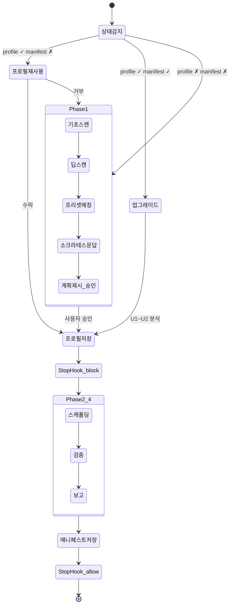

# harness-setup

Node.js/TypeScript 프로젝트에 **에이전트 작업 환경(하네스)**을 자동으로 셋업하는 Claude Code 스킬.

소스 코드를 분석하고, 사용자와 문답을 거쳐, 프로젝트에 맞는 문서/설정/검증 스크립트를 생성한다.
기존 소스 코드는 절대 수정하지 않는다.

---

## 하네스란?

에이전트가 프로젝트를 **이해하고, 작업하고, 검증하고, 정리**할 수 있도록 돕는 작업 환경 전체.

하네스가 없는 프로젝트에서 에이전트는 매 세션마다 프로젝트를 처음부터 파악해야 한다. 하네스가 있으면:
- AGENTS.md로 프로젝트 맥락을 즉시 파악
- CLAUDE.md로 작업 규칙과 명령어를 확인
- ARCHITECTURE.md로 아키텍처 규칙을 준수
- `.claude/rules/`로 세션 루틴, 코딩 표준, Git 규칙을 자동 적용
- `agents/*.md`로 TDD subagent 파이프라인을 구동
- feature_list.json으로 진행 상태를 추적
- structural-test.ts로 아키텍처 위반을 자동 감지
- init.sh로 개발 환경을 한 번에 초기화

---

## 2-스킬 구조

하네스 셋업은 두 개의 스킬이 자동 체이닝으로 연결된다:

| 스킬 | 역할 | 산출물 |
|------|------|--------|
| **`/harness-setup`** | Phase 1: 프로젝트 스캔 + Q&A + 프로필 저장 | `.harness-profile.json` |
| **`/harness-scaffold`** | Phase 2~4: 파일 생성 + 검증 + 보고 | 18개 파일 + `.harness-manifest.json` |

### 자동 체이닝

사용자가 `/harness-setup`만 실행하면 나머지는 자동으로 진행된다:

1. `harness-setup`이 프로필을 저장하면 **Stop hook**이 발동한다
2. 프로필은 있지만 매니페스트가 없으므로 hook이 `block`을 반환한다
3. `additionalContext`로 `/harness-scaffold` 호출을 지시한다
4. scaffold가 모든 파일을 생성하고 매니페스트를 저장하면 hook이 `allow`를 반환한다

---

## 실행 흐름



---

## 시나리오별 동작

### 1. 신규 셋업 (가장 일반적)

프로필과 매니페스트가 모두 없는 프로젝트.

```
사용자: "하네스 셋업해줘"
→ 자동 스캔 → 2~4개 질문 → 프로필 승인 → 18개 파일 자동 생성 → 완료
```

사용자가 하는 일은 **(1) 셋업 요청, (2) 질문에 답변, (3) 프로필 승인** 세 가지뿐이다.

### 2. 중단 후 재개

이전 세션에서 프로필까지 저장하고 중단된 경우.

```
사용자: "/harness-setup"
→ "기존 프로필이 발견되었습니다. 사용할까요?" → 수락 → scaffold 자동 실행
```

### 3. 업그레이드

이미 하네스가 완성된 프로젝트를 최신 버전으로 갱신.

```
사용자: "하네스 업그레이드해줘"
→ 현재 버전 ↔ 최신 버전 비교 → 변경된 부분만 갱신
```

### 4. Bootstrap

수동으로 AGENTS.md 등을 만들어둔 프로젝트 (매니페스트 없음).

```
→ 기존 파일 분석 → 프로필 역추론 → 빠진 파일만 보충
```

---

## 생성되는 파일

| 카테고리 | 파일 | 역할 |
|----------|------|------|
| **문서** | `AGENTS.md` | 프로젝트 개요, 스택, 아키텍처 링크, 문서 맵 (100줄 이내) |
| | `CLAUDE.md` | 명령어, 에이전트 디스패치, 세션 루틴, 금지 사항 |
| | `ARCHITECTURE.md` | 레이어/슬라이스 규칙, 의존성 방향, 네이밍 규칙 |
| **규칙** | `.claude/rules/session-routine.md` | TDD 오케스트레이션 상세 |
| | `.claude/rules/coding-standards.md` | 코드 규칙 (프로필 기반) |
| | `.claude/rules/git-workflow.md` | Git 커밋/브랜치 규칙 |
| **에이전트** | `agents/architect.md` | Pre-Red: 설계 + 테스트 계획 |
| | `agents/test-engineer.md` | Red: 테스트 작성 |
| | `agents/implementer.md` | Green: 구현 |
| | `agents/reviewer.md` | Post-Green: 코드 리뷰 |
| | `agents/simplifier.md` | Refactor: 단순화 |
| | `agents/debugger.md` | On-demand: 디버깅 |
| | `agents/security-reviewer.md` | Post-Green: 보안 리뷰 |
| **추적** | `feature_list.json` | 기능 목록 + 검증 상태 추적 |
| | `claude-progress.txt` | 세션별 작업 기록 + TDD STATE |
| **스크립트** | `init.sh` | 의존성 설치 + 개발 서버 실행 + 준비 확인 |
| | `scripts/structural-test.ts` | 아키텍처 의존성 규칙 자동 검증 |
| | `scripts/doc-freshness.ts` | 문서 최신성 검사 |
| **품질** | `docs/QUALITY_SCORE.md` | 6개 카테고리 품질 점수표 |
| | `docs/TECH_DEBT.md` | 기술 부채 추적 (4단계 심각도) |
| | `docs/HARNESS_FRICTION.md` | 마찰 로그 (피드백 수집) |
| **기타** | `docs/product-specs/` | 제품 요구사항 문서 디렉토리 |
| | `docs/design-docs/` | 설계 결정 기록 디렉토리 |
| | `docs/exec-plans/` | 작업별 실행 계획 디렉토리 |
| | `docs/references/` | 참고 자료 디렉토리 |
| | `package.json` | `lint:arch`, `validate`, `doc:check` 스크립트 추가 |
| | `.harness-manifest.json` | 버전 추적 매니페스트 |

---

## 지원 아키텍처

| 유형 | 감지 기준 | 검증 내용 |
|------|----------|----------|
| **레이어 기반** (`layer-based`) | types/, lib/, services/, hooks/, components/ 등 | 레이어 의존성 방향 |
| **FSD** (`fsd`) | app/, pages/, widgets/, features/, entities/, shared/ | 레이어 + cross-slice + public API |
| **도메인 기반** (`domain-based`) | 도메인명 폴더 아래 components, hooks 등 | 도메인 간 직접 import 금지 |
| **자유 구조** (`custom`) | 위 패턴에 해당 안 됨 | 문답에서 확인된 규칙만 |

---

## 프리셋 시스템

프리셋은 특정 스택+아키텍처 조합의 기본 프로필이다. `presets/` 폴더에 JSON으로 정의한다.

### 내장 프리셋

| 프리셋 | 스택 | 아키텍처 |
|--------|------|---------|
| `react-next` | React 19 + Next.js 15 (App Router) | 8레이어 (types→...→app) |
| `react-router-fsd` | React + React Router v7 | FSD 6레이어 (shared→...→app) |

### 매칭 로직

1. `detection.required` 패키지 전부 존재하는지 확인
2. `detection.versionConstraints`로 버전 범위 체크 (있을 경우)
3. `architecture.type`이 딥스캔 결과와 일치하는지 확인
4. 여러 후보 → optional 매칭 수 → required 수 → 사용자 선택

### 커스텀 프리셋 추가

`presets/` 폴더에 JSON 파일을 만들면 자동으로 매칭 대상에 포함된다.
필수 필드: `name`, `displayName`, `detection.required`, `architecture.type`, `architecture.layers`, `scripts.lint:arch`, `devServer`, `pathAlias`, `srcRoot`.
기존 프리셋을 복사하여 수정하는 것이 가장 빠르다.

---

## 설치

```bash
# GitHub에서 클론
git clone https://github.com/daehyunk1m/harness-setup-initializer.git \
  ~/.claude/skills/harness-setup

# 업데이트
cd ~/.claude/skills/harness-setup && git pull
```

## 사용

```bash
cd ~/projects/my-project

# 방법 1: 자연어 트리거
claude
> 하네스 셋업해줘

# 방법 2: 슬래시 커맨드
claude
> /harness-setup

# 방법 3: 스킬 디렉토리 직접 지정 (개발/테스트)
claude --add-dir ~/.claude/skills/harness-setup
> 하네스 셋업해줘
```

> 설치 후 `install.sh`를 실행하면 `harness-scaffold` 심볼릭 링크가 자동 생성되어 두 스킬이 함께 로딩된다.
> ```bash
> git clone <repo> ~/.claude/skills/harness-setup && ~/.claude/skills/harness-setup/install.sh
> ```

---

## 디렉토리 구조

```
harness-setup/
├── SKILL.md                          # 분석 스킬 (Phase 1 + Stop hook 오케스트레이션)
├── README.md                         # 이 파일
├── harness-scaffold/
│   └── SKILL.md                      # 스캐폴딩 스킬 (Phase 2~4, 심볼릭 링크로 디스커버리)
├── install.sh                        # 심볼릭 링크 생성 스크립트
├── presets/
│   ├── react-next.json               # React + Next.js (App Router, 레이어 기반)
│   └── react-router-fsd.json         # React Router v7 + FSD
├── templates/
│   ├── agents/                       # TDD subagent 정의 템플릿 (7개)
│   │   ├── architect.md
│   │   ├── test-engineer.md
│   │   ├── implementer.md
│   │   ├── reviewer.md
│   │   ├── simplifier.md
│   │   ├── debugger.md
│   │   └── security-reviewer.md
│   ├── rules/                        # .claude/rules/ 템플릿 (3개)
│   │   ├── session-routine.md
│   │   ├── coding-standards.md
│   │   └── git-workflow.md
│   ├── structural-test-layer.ts      # 레이어 기반 아키텍처 검증 템플릿
│   ├── structural-test-fsd.ts        # FSD 아키텍처 검증 템플릿
│   ├── init.sh                       # 환경 초기화 스크립트 템플릿
│   ├── doc-freshness.ts              # 문서 최신성 검사 스크립트 템플릿
│   ├── QUALITY_SCORE.md              # 품질 점수표 템플릿
│   ├── TECH_DEBT.md                  # 기술 부채 문서 템플릿
│   └── HARNESS_FRICTION.md           # 마찰 로그 템플릿
├── companion-skills/
│   └── harness-feedback/             # 피드백 분석→Issue 스킬 (향후)
├── references/
│   ├── harness-guide.md              # 하네스 엔지니어링 이론 (P1~P10)
│   └── project-context.md            # 설계 결정 기록 + 버전 히스토리
├── .claude/
│   ├── commands/
│   │   ├── gc.md                     # /gc — git commit 커맨드
│   │   └── gs.md                     # /gs — git sync 커맨드
│   ├── rules/
│   │   └── git-workflow.md           # Git 워크플로 규칙 (패시브)
│   └── settings.local.json           # 권한 설정 (WebSearch, WebFetch, git)
└── .tracking/
    ├── CHANGELOG.md                  # 변경 이력
    ├── TODO.md                       # 작업 추적
    └── HANDOFF.md                    # 세션 간 컨텍스트 전달
```

### 파일별 역할

| 파일 | 용도 | 누가 읽는가 |
|------|------|------------|
| `SKILL.md` | Phase 1 동작 사양 + Stop hook 오케스트레이션 | Claude Code (스킬 실행 시) |
| `harness-scaffold/SKILL.md` | Phase 2~4 동작 사양 (파일 생성 + 검증) | Claude Code (자동 체이닝 시) |
| `presets/*.json` | 스택별 기본 프로필 | SKILL.md Phase 1 Step 3 |
| `templates/*` | 파일 생성의 기반 템플릿 | harness-scaffold/SKILL.md Phase 2 |
| `references/*.md` | 설계 배경, 이론적 근거 | 개발자 (참고용) |
| `.tracking/*` | 개선 작업 이력 | 개발자 (유지보수 시) |

---

## 주요 설계 결정

### 기존 코드 무수정 원칙
이 스킬은 문서와 설정 파일만 추가한다. 기존 `.ts`, `.tsx`, `.js`, `.css`, `tsconfig.json`, `eslint` 등은 절대 건드리지 않는다. package.json도 `scripts` 필드에 항목을 추가하는 것만 허용한다.

### 2-스킬 분리
분석(harness-setup)과 생성(harness-scaffold)을 분리하여 각 스킬의 컨텍스트 윈도우를 효율적으로 사용한다. Stop hook이 자동 체이닝을 보장하므로 사용자 경험은 단일 스킬과 동일하다.

### 소크라테스 문답
고정된 설문지가 아니라, 스캔 결과에서 불확실한 부분만 골라 질문한다. 이미 코드에서 확인된 것은 묻지 않고, 한 번에 3개 이내만 묻는다. 최대 3라운드 후 미확정 항목은 추론값을 사용한다.

### AGENTS.md vs CLAUDE.md 분리
- **AGENTS.md** = "이 프로젝트는 무엇인가" (맥락) — 프로젝트 개요, 아키텍처 설명, 문서 맵
- **CLAUDE.md** = "어떻게 작업할 것인가" (행동) — 명령어, 코드 규칙, 세션 루틴, 금지 사항
- 동일 정보를 중복하지 않는다. CLAUDE.md에서 `@AGENTS.md`로 import.

### 프리셋 우선, 문답 보완
프리셋이 매칭되면 초기 프로필로 사용하고, 문답은 미세 조정에만 사용한다. 매칭 안 되면 문답으로 처음부터 구성한다.

---

## 남은 작업

상세 현황은 `.tracking/HANDOFF.md`에 기록되어 있다. `.tracking/TODO.md`에서 개별 항목을 추적한다.
