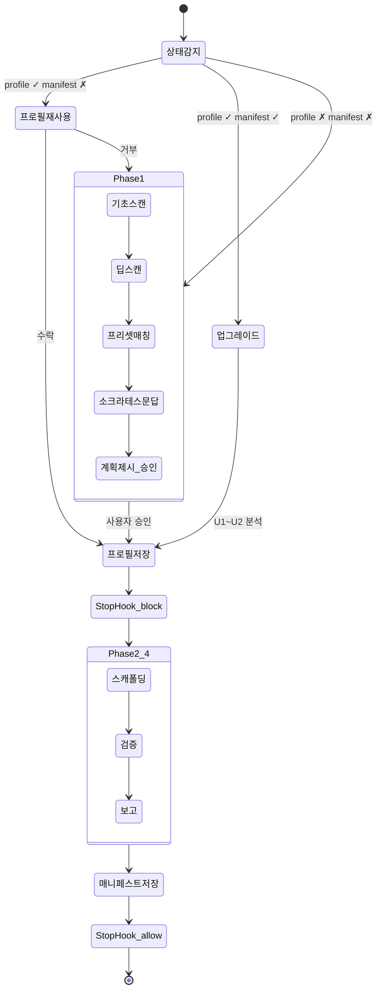

# harness-setup

> 현재 버전: **1.23.0** · 상세 이력: [`.tracking/CHANGELOG.md`](.tracking/CHANGELOG.md)

Node.js/TypeScript 프로젝트에 **에이전트 작업 환경(하네스)**을 자동으로 셋업하는 Claude Code 스킬.

소스 코드를 분석하고, 사용자와 문답을 거쳐, 프로젝트에 맞는 문서/설정/검증 스크립트를 생성한다.
기존 소스 코드는 수정하지 않는다 (옵트인한 설정 보강 제외 — 아래 [설계 결정](#기존-코드-무수정-원칙) 참조).

---

## 하네스란?

에이전트가 프로젝트를 **이해하고, 작업하고, 검증하고, 정리**할 수 있도록 돕는 작업 환경 전체.

하네스가 없는 프로젝트에서 에이전트는 매 세션마다 프로젝트를 처음부터 파악해야 한다. 하네스가 있으면:
- AGENTS.md로 프로젝트 맥락 + 명령어를 즉시 파악 (명령어의 source of truth)
- CLAUDE.md로 작업 규칙·에이전트 디스패치·운영 사이클을 확인
- ARCHITECTURE.md로 아키텍처 규칙을 준수
- `.claude/rules/`로 세션 루틴, 코딩 표준, Git 규칙을 자동 적용
- `agents/*.md`로 TDD subagent 파이프라인을 구동
- feature_list.json으로 진행 상태를 추적
- structural-test.ts로 아키텍처 위반을 자동 감지 (exit 1)
- (프론트엔드 옵트인) Playwright `*.e2e.ts`로 UI·시각/레이아웃 회귀를 실제 브라우저에서 검증
- init.sh로 개발 환경을 한 번에 초기화
- `npm run harness:check`로 하네스 상태를 자가진단 ("표준 하네스 가동" 판정 — 구조 설치·실행 가능성을 확인하며, 문서·규칙의 의미 정확성은 별도 검토 권장; `node_modules` 부재 시 "의존성 미설치 (구조 정상)"으로 구분)
- `.harness-friction.jsonl`에 작업 마찰이 자동 기록되어 harness-feedback이 개선 Issue로 환류
- 인프라/설정 작업은 인프라/설정 트랙으로 유닛 TDD 대신 통합 검증(빌드+실동작)을 적용

그리고 운영 단계에서는 **컴패니언 스킬**이 정리·피드백·교차 자문을 돕는다 (아래 [컴패니언 스킬](#컴패니언-스킬) 참조).

---

## 2-스킬 구조

하네스 셋업은 두 개의 스킬이 자동 체이닝으로 연결된다:

| 스킬 | 역할 | 산출물 |
|------|------|--------|
| **`/harness-setup`** | Phase 1: 프로젝트 스캔 + Q&A + 프로필 저장 | `.harness-profile.json` |
| **`/harness-scaffold`** | Phase 2~4: 파일 생성 + 검증 + 보고 | 19개 파일(기본) + `.harness-friction.jsonl` + `.harness-manifest.json` (옵트인 시 E2E·pre-push 추가) |

### 자동 체이닝

사용자가 `/harness-setup`만 실행하면 나머지는 자동으로 진행된다:

1. `harness-setup`이 프로필을 저장하면 **Stop hook**이 발동한다
2. 프로필은 있지만 매니페스트가 없으므로 hook이 `block`을 반환한다
3. `additionalContext`로 `/harness-scaffold` 호출을 지시한다
4. scaffold가 모든 파일을 생성하고 매니페스트를 저장하면 hook이 `allow`를 반환한다

---

## 실행 흐름



---

## 시나리오별 동작

### 1. 신규 셋업 (가장 일반적)

프로필과 매니페스트가 모두 없는 프로젝트.

```
사용자: "하네스 셋업해줘"
→ 자동 스캔 → 2~4개 질문 → 프로필 승인 → 19개 파일 자동 생성 → 완료
```

사용자가 하는 일은 **(1) 셋업 요청, (2) 질문에 답변, (3) 프로필 승인** 세 가지뿐이다.

### 2. 중단 후 재개

이전 세션에서 프로필까지 저장하고 중단된 경우.

```
사용자: "/harness-setup"
→ "기존 프로필이 발견되었습니다. 사용할까요?" → 수락 → scaffold 자동 실행
```

### 3. 업그레이드

이미 하네스가 완성된 프로젝트를 최신 버전으로 갱신.

```
사용자: "하네스 업그레이드해줘"
→ 현재 버전 ↔ 최신 버전 비교 → 변경된 부분만 갱신
```

### 4. Bootstrap

수동으로 AGENTS.md 등을 만들어둔 프로젝트 (매니페스트 없음).

```
→ 기존 파일 분석 → 프로필 역추론 → 빠진 파일만 보충
```

---

## 생성되는 파일

| 카테고리 | 파일 | 역할 |
|----------|------|------|
| **문서** | `AGENTS.md` | 프로젝트 개요, **명령어(source of truth)**, 아키텍처 링크, 주요 규칙, 문서 맵 (100줄 이내) |
| | `CLAUDE.md` | 에이전트 디스패치, 세션 루틴, 운영 사이클, 금지 사항 (`@AGENTS.md` import) |
| | `ARCHITECTURE.md` | 레이어/슬라이스 규칙, 의존성 방향, 네이밍 규칙 |
| **규칙** | `.claude/rules/session-routine.md` | TDD 오케스트레이션 상세 |
| | `.claude/rules/coding-standards.md` | 코드 규칙 + 검증 레벨 (프로필 기반) |
| | `.claude/rules/git-workflow.md` | Git 커밋/브랜치 규칙 + 자동 커밋 정책 |
| **에이전트** | `agents/architect.md` | Pre-Red: 설계 + 테스트 계획 |
| | `agents/test-engineer.md` | Red: 테스트 작성 |
| | `agents/implementer.md` | Green: 구현 |
| | `agents/reviewer.md` | Post-Green: 코드 리뷰 + 자동 검사 승격 후보 표시 |
| | `agents/simplifier.md` | Refactor: 단순화 |
| | `agents/debugger.md` | On-demand: 디버깅 |
| | `agents/security-reviewer.md` | Post-Green: 보안 리뷰 |
| **추적** | `feature_list.json` | 기능 목록 + 검증 상태 추적 (steps ↔ E2E 1:1, `category: infra/config` 분류) |
| | `claude-progress.txt` | 세션별 작업 기록 + TDD STATE |
| **스크립트** | `init.sh` | 의존성 설치 + 개발 서버 실행 + 준비 확인 |
| | `scripts/structural-test.ts` | 아키텍처 의존성 규칙 자동 검증 (위반 시 exit 1) |
| | `scripts/doc-freshness.ts` | 문서 최신성 검사 |
| | `scripts/harness-check.sh` | 하네스 자가진단 (구조 ①②③·품질 ④⑤⑥·경고 ⑦⑧⑨; ⑧ E2E·⑨ pre-push는 옵트인 시에만, `node_modules` 부재 시 ④⑤⑥ "의존성 미설치로 보류"·exit 0, `npm run harness:check`) |
| **품질** | `docs/QUALITY_SCORE.md` | 6개 카테고리 품질 점수표 |
| | `docs/TECH_DEBT.md` | 기술 부채 추적 (4단계 심각도) + 자동 검사 승격 대기 큐 |
| | `docs/HARNESS_FRICTION.md` | 마찰 이벤트 유형·심각도 정적 참조표 + 이슈 보고 안내 (실제 이벤트는 `.harness-friction.jsonl` 기록) |
| | `.harness-friction.jsonl` | 마찰 이벤트 자동 기록 싱크 — append-only JSONL, 빈 파일로 생성 (always-on, harness-feedback이 파싱) |
| **기타** | `docs/product-specs/` 외 3개 | 제품 요구사항·설계 결정·실행 계획·참고 자료 디렉토리 |
| | `package.json` | `lint:arch`, `validate`, `doc:check`, `harness:check` 스크립트 추가 |
| | `.harness-manifest.json` | 버전 추적 매니페스트 |

> **옵트인 산출물** (문답에서 동의한 경우만): E2E 스캐폴드(`playwright.config.ts` + `e2e/` + `test:e2e`, 프론트엔드), pre-push `@critical` 게이트(`.githooks/pre-push`), 브라우저 MCP 진단 배선(`debugger.md`), AGENTS.md "보조 스킬" 섹션(외부 통합 연계), ESLint 보조 규칙(설정 파일에 마커 블록), `test:run` 스크립트(watch 러너 가드), 자동 커밋 정책. 동의하지 않으면 어떤 흔적도 생성되지 않는다. (`.harness-friction.jsonl` 마찰 기록은 옵트인이 아니라 always-on이다.)

---

## 지원 아키텍처

| 유형 | 감지 기준 | 검증 내용 |
|------|----------|----------|
| **레이어 기반** (`layer-based`) | types/, lib/, services/, hooks/, components/ 등 | 레이어 의존성 방향 |
| **FSD** (`fsd`) | app/, pages/, widgets/, features/, entities/, shared/ | 레이어 + cross-slice + public API |
| **도메인 기반** (`domain-based`) | 도메인명 폴더 아래 components, hooks 등 | 도메인 간 직접 import 금지 + 공유→도메인 역방향 금지 |
| **자유 구조** (`custom`) | 위 패턴에 해당 안 됨 | 프로필에서 기계 검사 가능한 규칙만 (동적 생성) |

---

## E2E 검증 (프론트엔드 옵트인)

프론트엔드 프로젝트에 한해 Playwright 기반 E2E 계층을 셋업할 수 있다. 전부 **옵트인**이며, 프로필에 `e2e` 블록이 없으면 어떤 파일도 생성하지 않는다. 프론트엔드 내장 프리셋(react-next·react-router-fsd·react-vite)은 `e2e: { enabled: true }`를 권장 기본으로 제시하되, 문답에서 거부/무응답하면 생략한다(옵트인 계약 불변). 백엔드(express-api)는 대상이 아니다.

| 항목 | 내용 |
|------|------|
| **생성 파일** | `playwright.config.ts`·`e2e/tsconfig.json`·`e2e/README.md`(managed) + `e2e/fixtures/*`·`e2e/specs/smoke.e2e.ts`(custom 스타터). `package.json`에 `test:e2e` + `@playwright/test` add-only 머지 (설치는 안내만, 실행 안 함) |
| **충돌 회피** | `*.e2e.ts` 네이밍으로 Vitest 글롭과 분리. `vitest.config`·root `tsconfig`는 수정하지 않음 |
| **TDD 배선** | VERIFY(E2E) Phase 4.7 — 해당 feature 스펙(`--grep @feature:{id}`)을 E2E 러너로 실행해 통과해야 완료. Test Engineer가 `created`/`skipped`/`not_applicable` 판정(침묵=BLOCK) |
| **작성 트리거** | UI 상호작용 **또는** 시각/레이아웃 회귀 위험(스크롤·오버플로·정렬·반응형). jsdom 유닛은 이 회귀를 못 잡으므로 L4 E2E 전용 |
| **pre-push 게이트** (옵트인 `e2e.prePush`) | `.githooks/pre-push`가 `validate` + `@critical` E2E를 차단 검증. `git config`는 실행하지 않음 — 활성화는 수동(`git config core.hooksPath .githooks`) |
| **MCP 진단** (옵트인 `e2e.mcp`, 독립) | debugger가 스펙 없는 UI 증상을 라이브 브라우저로 탐색. 공유 `.mcp.json` 비커밋 — 개발자 로컬 `claude mcp add` 등록 |

> **구조만 보장**한다 — 파일·스크립트·태그는 생성하되, 스위트의 통과(green)는 앱별 부팅(env·라우트)에 의존하므로 실행하지 않는다.

---

## 프리셋 시스템

프리셋은 특정 스택+아키텍처 조합의 기본 프로필이다. `presets/` 폴더에 JSON으로 정의한다.

### 내장 프리셋

| 프리셋 | 스택 | 아키텍처 |
|--------|------|---------|
| `react-next` | React 19 + Next.js 15 (App Router) | layer-based 8레이어 (types→…→app) |
| `react-router-fsd` | React + React Router v7 | FSD 6레이어 (shared→…→app) |
| `react-vite` | React + Vite (SPA) | layer-based 7레이어 |
| `express-api` | Express + TypeScript (Node 백엔드) | layer-based 8레이어 (routes→controllers→services→models) |

### 매칭 로직

1. `detection.required` 패키지 전부 존재하는지 확인
2. `detection.exclude` 패키지가 존재하면 후보에서 제외 (범용 required의 오매칭 방지)
3. `detection.versionConstraints`로 버전 범위 체크 (있을 경우)
4. `architecture.type`이 딥스캔 결과와 일치하는지 확인
5. 여러 후보 → optional 매칭 수 → required 수 → 사용자 선택

### 커스텀 프리셋 추가

`presets/` 폴더에 JSON 파일을 만들면 자동으로 매칭 대상에 포함된다.
필수 필드: `name`, `displayName`, `detection.required`, `architecture.type`, `architecture.layers`, `scripts.lint:arch`, `devServer`, `pathAlias`, `srcRoot`.
기존 프리셋을 복사하여 수정하는 것이 가장 빠르다.

---

## 컴패니언 스킬

harness-setup 플러그인에 아래 스킬이 번들로 포함되어, 플러그인 설치 시 자연어로 바로 호출할 수 있다.

| 스킬 | 트리거 | 역할 |
|------|--------|------|
| **harness-cleanup** | "하네스 정리" | 운영 사이클(주간/격주/월간) 실행 — 문서 부식·QUALITY_SCORE 재측정·TECH_DEBT·승격 큐·passes 재검증. 소스 코드는 수정하지 않고 TDD 사이클에 위임 |
| **harness-feedback** | "하네스 피드백 분석해줘" | `.harness-friction.jsonl` 마찰 이벤트(JSONL)를 분석해 반복 패턴을 식별하고 이 리포에 개선 Issue 생성 |
| **multi-model-consult** | "멀티모델 자문" / "교차 자문" | Codex·Gemini CLI에 관점을 분담해 자문하고 Claude가 합성(합의/상충/최종방향/액션). 읽기 전용, 하네스 비의존 범용 도구 |

---

## 외부 통합 (옵트인)

셋업 시 외부 보조 스킬이 감지되면 연계 여부를 묻는다 (미감지 시 질문 자체를 생략). 동의하면 AGENTS.md "보조 스킬" 섹션에 호출 안내가 1줄씩 추가된다. 메커니즘 규약: [`references/integrations/_protocol.md`](references/integrations/_protocol.md).

| 통합 | 감지 | 연계 영역 (코어 충돌 영역은 제외) |
|------|------|----------------------------------|
| **superpowers** | 플러그인/스킬 | brainstorming(설계 결정), systematic-debugging(버그 추적), writing-plans(계획 문서) |
| **multiModelConsult** | 번들 + CLI | 복잡한 설계 결정·트레이드오프의 교차 자문 |

> TDD·코드 리뷰·검증·git 워크플로는 항상 하네스 자체 워크플로가 source of truth다.

---

## 설치

Claude Code 플러그인으로 설치한다 (세션에서 입력):

```
/plugin marketplace add daehyunk1m/harness-setup-initializer
/plugin install harness-setup@harness-setup-initializer
/reload-plugins
```

5개 스킬(harness-setup·harness-scaffold·harness-cleanup·harness-feedback·multi-model-consult)이 함께 번들로 로딩된다.

## 사용

프로젝트에서 자연어 또는 슬래시 커맨드로 트리거한다:

```
> 하네스 셋업해줘
> /harness-setup
```

> **레거시(git clone + install.sh)에서 이전**: 1.23.0부터 배포가 플러그인으로 전환됐다. 기존 클론에서 `./install.sh`를 한 번 실행하면 구 심볼릭 링크를 정리하고 플러그인 설치를 안내한다. `git pull`로는 더 이상 스킬이 갱신되지 않으며, 개발 클론은 `~/.claude/skills/` 밖에 두는 것을 권장한다.

---

## 디렉토리 구조

```
harness-setup/                          # 마켓플레이스 = 플러그인 루트 (source "./")
├── .claude-plugin/
│   ├── plugin.json                     # 플러그인 매니페스트
│   └── marketplace.json                # 셀프 호스팅 마켓플레이스 카탈로그
├── README.md                           # 이 파일
├── LICENSE                             # MIT
├── install.sh                          # 레거시→플러그인 마이그레이션 스크립트 (구 심링크 정리 + 안내)
├── skills/
│   ├── harness-setup/
│   │   ├── SKILL.md                    # 분석 스킬 (Phase 1 + Stop hook 오케스트레이션)
│   │   ├── presets/                    # 스택별 프리셋 (react-next·react-router-fsd·react-vite·express-api)
│   │   └── references/                 # 설계 문서 + 통합 규약 (SSoT)
│   │       ├── harness-guide.md        # 하네스 엔지니어링 이론 (P1~P10)
│   │       ├── harness-checklist.md    # 하네스 구성 체크리스트 (판정 기준)
│   │       ├── versioning-policy.md    # semver 버전 정책
│   │       ├── upgrade-system-design.md
│   │       ├── integrations/           # _protocol.md + superpowers·multi-model-consult 매핑
│   │       └── project-context.md      # 설계 결정 + 버전 히스토리
│   ├── harness-scaffold/
│   │   ├── SKILL.md                    # 스캐폴딩 스킬 (Phase 2~4)
│   │   ├── templates/                  # 생성 템플릿 (agents·rules·e2e·structural-test·scripts·docs)
│   │   └── references → ../harness-setup/references   # 심링크 (SSoT — 중복 없음)
│   ├── harness-cleanup/SKILL.md        # 엔트로피 정리 — 운영 사이클 실행
│   ├── harness-feedback/SKILL.md       # 마찰 로그 분석 → GitHub Issue
│   └── multi-model-consult/
│       ├── SKILL.md                    # 멀티모델 합성 자문 (codex/gemini + Claude)
│       └── scripts/run-advisor.js
├── test/                               # 스킬 자체 골든 픽스처 (run·e2e·mcp·prepush·feedback-cursor)
├── .claude/                            # 이 리포 자체의 개발 환경 (커맨드/규칙/설정)
└── .tracking/
    ├── CHANGELOG.md                    # 변경 이력
    ├── TODO.md                         # 작업 추적
    └── HANDOFF.md                      # 세션 간 컨텍스트 전달
```

### 파일별 역할

| 파일 | 용도 | 누가 읽는가 |
|------|------|------------|
| `skills/harness-setup/SKILL.md` | Phase 1 동작 사양 + Stop hook 오케스트레이션 | Claude Code (스킬 실행 시) |
| `skills/harness-scaffold/SKILL.md` | Phase 2~4 동작 사양 (파일 생성 + 검증) | Claude Code (자동 체이닝 시) |
| `skills/harness-setup/presets/*.json` | 스택별 기본 프로필 | SKILL.md Phase 1 Step 3 |
| `skills/harness-scaffold/templates/*` | 파일 생성의 기반 템플릿 | harness-scaffold/SKILL.md Phase 2 |
| `skills/harness-setup/references/*.md` | 설계 배경, 이론적 근거 (harness-scaffold는 심링크로 공유) | 개발자 + scaffold 런타임 |
| `.tracking/*` | 개선 작업 이력 | 개발자 (유지보수 시) |

---

## 주요 설계 결정

### 기존 코드 무수정 원칙
이 스킬은 문서와 설정 파일만 추가한다. 기존 `.ts`, `.tsx`, `.js`, `.css`, `tsconfig.json` 등 소스/설정은 건드리지 않는다. **명시적 예외**(사용자가 문답에서 옵트인한 경우에만): package.json `scripts` 필드 추가, ESLint 설정에 보조 규칙 마커 블록 삽입(파싱 불가 시 권고 스니펫으로 폴백, 설정 JS는 실행하지 않음). tsconfig는 어떤 경우에도 수정하지 않고 검사만 한다.

### 2-스킬 분리
분석(harness-setup)과 생성(harness-scaffold)을 분리하여 각 스킬의 컨텍스트 윈도우를 효율적으로 사용한다. Stop hook이 자동 체이닝을 보장하므로 사용자 경험은 단일 스킬과 동일하다. hook은 프로필의 `approved: true`를 확인한 뒤에만 발동한다.

### 소크라테스 문답
고정된 설문지가 아니라, 스캔 결과에서 불확실한 부분만 골라 질문한다. 이미 코드에서 확인된 것은 묻지 않고, 한 번에 3개 이내만 묻는다. 최대 3라운드 후 미확정 항목은 추론값을 사용한다. 옵트인 항목(ESLint 보조 규칙·외부 통합·자동 커밋)은 감지됐을 때만 묻고, 거부하면 어떤 산출물도 만들지 않는다.

### AGENTS.md vs CLAUDE.md 분리
- **AGENTS.md** = "이 프로젝트는 무엇인가" (맥락) — 프로젝트 개요, **명령어(source of truth)**, 아키텍처 설명, 주요 규칙, 문서 맵
- **CLAUDE.md** = "어떻게 작업할 것인가" (행동) — 에이전트 디스패치, 세션 루틴, 운영 사이클, 금지 사항
- 동일 정보를 중복하지 않는다. CLAUDE.md에서 `@AGENTS.md`로 import. 명령어를 AGENTS.md에 두는 이유는 CLAUDE.md를 읽지 않는 범용 에이전트도 명령을 알 수 있어야 하기 때문이다.

### 프리셋 우선, 문답 보완
프리셋이 매칭되면 초기 프로필로 사용하고, 문답은 미세 조정에만 사용한다. 매칭 안 되면 문답으로 처음부터 구성한다.

### 옵트인 자동 커밋 (1.8.0)
기본은 "커밋 제안만"이다. 원하면 `confirm`(메시지+diff 승인 후 commit+push) 또는 `auto` 모드를 옵트인할 수 있다. 단 위험 작업(`push --force`·`reset --hard`·대규모 변경·의존성)은 어느 모드에서도 항상 사용자 승인을 받는다 — 자동화 대상은 정상 TDD 커밋뿐이다.

### 추측 설계 금지
실제 마찰/데이터가 없는 기능은 만들지 않는다. 외부 통합 규약은 두 선례(superpowers·multi-model-consult)가 확보된 뒤에야 일반화했고, 해시 재현성 같은 개선은 방향만 확정하고 실제 오탐이 누적될 때 구현하기로 둔다.

### E2E 옵트인 모듈 (1.11.0~1.17.0)
E2E는 항상 옵트인이며, 충돌을 피하기 위해 스펙을 `*.e2e.ts`로 네이밍하고(Vitest 글롭 비충돌) root `tsconfig`는 절대 건드리지 않는다. 구조(파일·스크립트·태그)만 보장하고 스위트 통과는 앱 부팅에 의존하므로 실행하지 않는다. TDD 사이클에는 VERIFY(E2E) Phase 4.7 + `@critical` pre-push로 배선했고, MCP 진단은 공유 `.mcp.json`을 커밋하지 않고 개발자 로컬 등록으로 둔다(nagware·머지 회피).

### 마찰 자동 기록 — JSONL 싱크 (1.18.0)
마찰 이벤트를 `.harness-friction.jsonl`에 한 줄 JSON으로 append한다. 이전의 마크다운 테이블 행 삽입은 무거워 부하 시 누락됐다(한 달 실사용에서 헤더만 남고 0건). 프로필 필드 없이 always-on이며, `HARNESS_FRICTION.md`는 정적 참조 문서로 격하했다. Stop hook은 발화 비보장·`settings.json` 의존성 때문에 채택하지 않고(measure-first) 저비용 `echo` append를 택했다.

### 인프라/설정 트랙 (1.20.0)
설정·배선 작업(feature_list `category: infra`/`config`)은 억지 유닛 테스트 대신 통합 검증(빌드+실동작)으로 검증한다. 남용 방지를 위해 사전 선언(재분류 금지)·부정 테스트("의미 있는 실패 테스트를 쓸 수 있으면 인프라 아님")·범위 한정을 두고, 모호하면 TDD로 돌아간다. Reviewer가 필수로 분류 타당성을 독립 감사하며, 보안 표면(.env·auth·provider 배선 등)에 닿으면 category가 infra라도 Security Reviewer가 필수다(이슈 #6 해소). 진입은 `claude-progress.txt` + `.harness-friction.jsonl`에 이중 기록한다.

---

## 남은 작업

상세 현황은 `.tracking/HANDOFF.md`에 기록되어 있다. `.tracking/TODO.md`에서 개별 항목을 추적한다.
